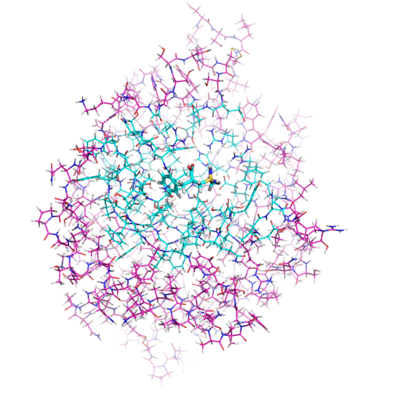
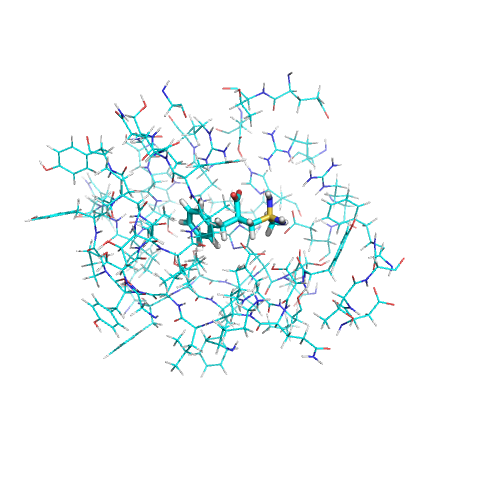

# Binding Site Scoop Templated

Sebastian Raschka 03/26/2015

A tool to extract protein substructures based on a protein-ligand template sites.

## Examples

Provide the reference residues via `--template_protein`  `--template_ligand`. Then, e.g., residues or atoms (default: residues) within k Angstrom (default: k = 9.0) of the ligand's heavy atoms are determined. Next, those residues are matched in the target structure (`--target_structure`) and written to a new file.

If the `--template_ligand` is in the same PDB file as the `--template_protein`, the same PDB file can be specified for `--template_ligand` and `--template_protein`.

Via `--apply_to_dir`, this template-based procedure is applied to a directory of target structures.

E.g., 

    python bindingsite_scoop_templated.py 
    --template_protein ./test_input_files/pdb_1.pdb 
    --template_ligand ./test_input_files/pdb_1.pdb 
    --target_structure ./test_input_files/ 
    --apply_to_dir 
    --output_pdb ./test_output_files 
    --radius 9.0 
    --extract residues
    
Input structure:

Output substructure

