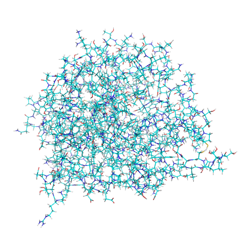
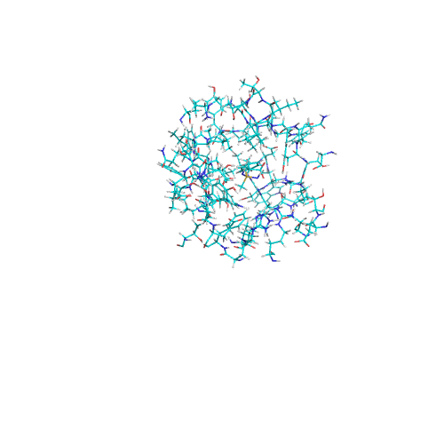

# Binding Site Scoop Untemplated

Sebastian Raschka 03/27/2015

A tool to extract protein substructures surrounding its bound ligand's heavy atoms.

## Examples

Residues or atoms (default: residues) within k Angstrom (default: k = 9.0) of the ligand's heavy atoms are extracted and saved as new substructure PDB files.

Via `--apply_to_dir`, this template-based procedure is applied to a directory of target structures.

E.g., 

    python bindingsite_scoop_templated.py 
    --target_structure ./test_input_files/ 
    --apply_to_dir 
    --output_pdb ./test_output_files 
    --radius 9.0 
    --extract residues
    
Input structure:

Output substructure

